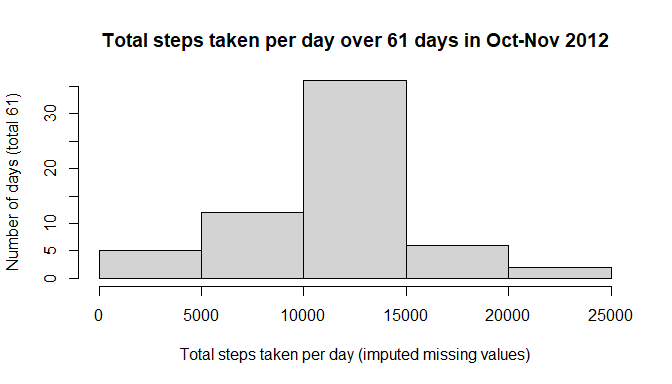
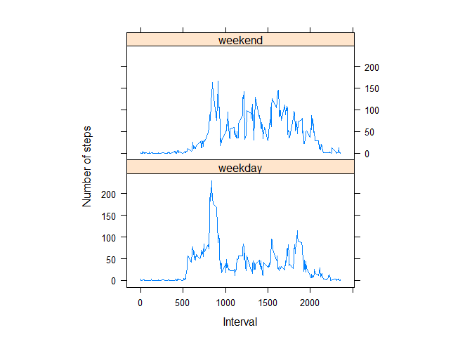

# *Reproducible Research Peer Assessment*


## Setting global options

```r
knitr::opts_chunk$set(echo = TRUE)
```


## Loading and preprocessing the data

Show any code that is needed to

1. Load the data (i.e. read.csv())

```r
strURL <- "https://d396qusza40orc.cloudfront.net/repdata%2Fdata%2Factivity.zip"
strZIP <- file.path(getwd(), "repdata%2Fdata%2Factivity.zip")
strCSV <- file.path(getwd(), "activity.csv")
if (!file.exists(strZIP)) {download.file(url = strURL, destfile = strZIP)} ## tested on Windows 10 only
if (!file.exists(strCSV)) {strCSV <- unzip(strZIP)}
dfStepsPerIntervalPerDay_orig <- read.csv(strCSV)
colnames(dfStepsPerIntervalPerDay_orig) <- c("steps", "date", "interval")
```

2. Process/transform the data (if necessary) into a format suitable for your analysis


## What is mean total number of steps taken per day?

For this part of the assignment, you can ignore the missing values in the dataset.

1. Calculate the total number of steps taken per day

```r
vectorTotStepsPerDay <- vector(length = 61) ## 61 days in Oct-Nov

for (r in (1:61)) {

    curr_date <- dfStepsPerIntervalPerDay_orig[r*288, "date"]

    dfStepsPerIntervalCurrDay <- subset(dfStepsPerIntervalPerDay_orig, date == curr_date)

    sumStepsCurrDay <- aggregate(
        x = dfStepsPerIntervalCurrDay$steps, 
        by = list(dfStepsPerIntervalCurrDay$date), 
        FUN = sum,
        na.rm = TRUE
    )
    
    vectorTotStepsPerDay[r] <- sumStepsCurrDay$x

}
```

2. If you do not understand the difference between a histogram and a barplot, research the difference between them. Make a histogram of the total number of steps taken each day

```r
hist(
    x = as.numeric(vectorTotStepsPerDay),
    xlab = "Total steps taken per day (removed missing values)",
    ylab = "Number of days (total 61)",
    main = "Total steps taken per day over 61 days in Oct-Nov 2012",
    breaks = 5,
    xlim = c(0,25000),
    ylim = c(0, 30),
    col = "lightgray"
)
```

<!-- -->

3. Calculate and report the mean and median of the total number of steps taken per day

```r
meanTotStepsPerDay <- round(mean(as.numeric(vectorTotStepsPerDay)), 2)
print(paste("MEAN of total number of steps taken per day (removed missing values):",
            meanTotStepsPerDay))
```

```
## [1] "MEAN of total number of steps taken per day (removed missing values): 9354.23"
```

```r
medianTotStepsPerDay <- round(median(as.numeric(vectorTotStepsPerDay)), 2)
print(paste("MEDIAN of total number of steps taken per day (removed missing values):",
            medianTotStepsPerDay))
```

```
## [1] "MEDIAN of total number of steps taken per day (removed missing values): 10395"
```


## What is the average daily activity pattern?

1. Make a time series plot (i.e. type = "l") of the 5-minute interval (x-axis) and the average number of steps taken, averaged across all days (y-axis)

```r
##--------
## matrix

matrixAvgStepsPerInterval <- matrix(1:576, nrow = 288, ncol = 2) ## 288 intervals per day
colnames(matrixAvgStepsPerInterval) <- c("interval", "avg_steps")
for (r in (1:288)) {

    curr_base <- trunc(r / 12) * 100
    curr_mod <- r %% 12
    if (curr_mod == 0) {
        curr_interval <- (curr_base - 100) + 55
    }
    else {
        curr_interval <- curr_base + ((curr_mod - 1) * 5)
    }

    dfStepsCurrIntervalPerDay <- subset(
        dfStepsPerIntervalPerDay_orig, 
        interval == curr_interval
    )

    avgStepsCurrInterval <- aggregate(
        x = dfStepsCurrIntervalPerDay$steps, 
        by = list(dfStepsCurrIntervalPerDay$interval), 
        FUN = mean,
        na.rm = TRUE
    )
    
    matrixAvgStepsPerInterval[r, "interval"] <- curr_interval
    matrixAvgStepsPerInterval[r, "avg_steps"] <- avgStepsCurrInterval$x        

}

##------
## plot

vectorInterval <- as.numeric(matrixAvgStepsPerInterval[, "interval"])
vectorAvgSteps <- as.numeric(matrixAvgStepsPerInterval[, "avg_steps"])

rangeInterval <- range(0, vectorInterval)
rangeAvgSteps <- range(0, vectorAvgSteps)

plot(
    type = "l", 
    x = vectorInterval,
    y = vectorAvgSteps,
    xlim = rangeInterval,
    ylim = rangeAvgSteps,
    xlab = "5-min interval (removed missing values)",
    ylab = "Average steps taken per 5-min interval",
    main = "Average steps taken per 5-min interval over 61 days in Oct-Nov 2012",
    col = "gray"
)
```

<!-- -->

2. Which 5-minute interval, on average across all the days in the dataset, contains the maximum number of steps?

```r
print(paste("5-minute interval containing maximum number of steps (removing missing values):", 
            vectorInterval[which.max(vectorAvgSteps)]))
```

```
## [1] "5-minute interval containing maximum number of steps (removing missing values): 835"
```


## Imputing missing values

Note that there are a number of days/intervals where there are missing values (coded as NA). 
The presence of missing days may introduce bias into some calculations or summaries of the data.

1. Calculate and report the total number of missing values in the dataset (i.e. the total number of rows with NAs)

```r
boolNA <- is.na(dfStepsPerIntervalPerDay_orig[, "steps"])

countNA <- length(dfStepsPerIntervalPerDay_orig[boolNA, "steps"])

print(paste("Total number of missing values (NAs):", countNA))
```

```
## [1] "Total number of missing values (NAs): 2304"
```

2. Devise a strategy for filling in all of the missing values in the dataset. The strategy does not need to be sophisticated. For example, you could use the mean/median for that day, or the mean for that 5-minute interval, etc.

* Strategy: Replace missing values in any interval with the mean of known values in that interval.
* Implementation: Under (3) below.

3. Create a new dataset that is equal to the original dataset but with the missing data filled in.

```r
dfStepsPerIntervalPerDay_imputed <- dfStepsPerIntervalPerDay_orig

r <- 1 ## row count
for (d in (1:61)) { ## days in Oct-Nov
    for (i in (1:288)) { ## intervals per day

        ##------
        ## date
        
        if (d <= 31) {
            curr_date <- sprintf("%s%02d", "2012-10-", d) 
        }
        else {
            curr_date <- sprintf("%s%02d", "2012-11-", d - 31) 
        }

        dfStepsPerIntervalPerDay_imputed[r, "date"] <- curr_date
        
        ##---------------------------------------------
        ## convert interval index to 5-minute interval
        
        curr_base <- trunc(i / 12) * 100
        curr_mod <- i %% 12
        if (curr_mod == 0) {
            curr_interval <- (curr_base - 100) + 55
        }
        else {
            curr_interval <- curr_base + ((curr_mod - 1) * 5)
        }

        dfStepsPerIntervalPerDay_imputed[r, "interval"] <- curr_interval
        
        ##-------
        ## steps
        
        if (is.na(dfStepsPerIntervalPerDay_orig[r, "steps"])) {

            dfStepsCurrIntervalPerDay <- subset(
                dfStepsPerIntervalPerDay_orig, 
                interval == curr_interval
            )

            avgStepsCurrInterval <- aggregate(
                x = dfStepsCurrIntervalPerDay$steps, 
                by = list(dfStepsCurrIntervalPerDay$interval), 
                FUN = mean,
                na.rm = TRUE
            )
        
            dfStepsPerIntervalPerDay_imputed[r, "steps"] <- 
                avgStepsCurrInterval$x
            
        }
        else {
            
            dfStepsPerIntervalPerDay_imputed[r, "steps"] <- 
                dfStepsPerIntervalPerDay_orig[r, "steps"]
            
        }
        r <- r + 1
    }
}
#print(dfStepsPerIntervalPerDay_imputed)
```

4. Make a histogram of the total number of steps taken each day and Calculate and report the mean and median total number of steps taken per day. Do these values differ from the estimates from the first part of the assignment? What is the impact of imputing missing data on the estimates of the total daily number of steps?

```r
vectorTotStepsPerDay <- vector(length = 61) 

for (r in (1:61)) {

    curr_date <- dfStepsPerIntervalPerDay_imputed[r*288, "date"]

    dfStepsPerIntervalCurrDay <- subset(dfStepsPerIntervalPerDay_imputed, date == curr_date)

    sumStepsCurrDay <- aggregate(
        x = dfStepsPerIntervalCurrDay$steps, 
        by = list(dfStepsPerIntervalCurrDay$date), 
        FUN = sum
    )
    
    vectorTotStepsPerDay[r] <- sumStepsCurrDay$x

}
```


```r
hist(
    x = as.numeric(vectorTotStepsPerDay),
    xlab = "Total steps taken per day (imputed missing values)",
    ylab = "Number of days (total 61)",
    main = "Total steps taken per day over 61 days in Oct-Nov 2012",
    breaks = 5,
    xlim = c(0,25000),
    ylim = c(0, 35),
    col = "lightgray"
)
```

<!-- -->


```r
meanTotStepsPerDay <- round(mean(as.numeric(vectorTotStepsPerDay)), 2)
print(paste("MEAN of total number of steps taken per day (imputed missing values):",
            print(meanTotStepsPerDay)))
```

```
## [1] 10766.19
## [1] "MEAN of total number of steps taken per day (imputed missing values): 10766.19"
```

```r
medianTotStepsPerDay <- round(median(as.numeric(vectorTotStepsPerDay)), 2)
print(paste("MEDIAN of total number of steps taken per day (imputed missing values)",
            medianTotStepsPerDay))
```

```
## [1] "MEDIAN of total number of steps taken per day (imputed missing values) 10766.19"
```


```r
print(paste(
"The impact of imputing missing values is that the distribution is corrected:",
"the plot now shows a normal distribution rather than one skewed to the left,",
"and both the mean and the median have increased (they now happen to be equal)."))
```

```
## [1] "The impact of imputing missing values is that the distribution is corrected: the plot now shows a normal distribution rather than one skewed to the left, and both the mean and the median have increased (they now happen to be equal)."
```


## Are there differences in activity patterns between weekdays and weekends?

For this part the weekdays() function may be of some help here. Use the dataset with the filled-in missing values for this part.

1. Create a new factor variable in the dataset with two levels - "weekday" and "weekend" indicating whether a given date is a weekday or weekend day.

```r
##----------------------------
## add variable "day_of_week"

dfStepsPerIntervalPerDay_imputed$day_of_week <- weekdays(
    x = as.Date(x = dfStepsPerIntervalPerDay_imputed$date, format = "%Y-%m-%d"),
    abbreviate = TRUE
)

##------------------------------------------
## add factor variable "weekend_or_weekday"

dfStepsPerIntervalPerDay_imputed$weekend_or_weekday <- as.factor(
    x = apply(
        X = dfStepsPerIntervalPerDay_imputed["day_of_week"], 
        MARGIN = 1, ## i.e. FUN below will be applied to *rows* of X above
        FUN = function(f) {switch(f, "Sun" = "weekend", "Sat" = "weekend", "weekday")}
    )
)
```

2. Make a panel plot containing a time series plot (i.e. type = "l") of the 5-minute interval (x-axis) and the average number of steps taken, averaged across all weekday days or weekend days (y-axis). See the README file in the GitHub repository to see an example of what this plot should look like using simulated data.

```r
library(lattice)

xyplot(
    x = steps ~ interval | factor(weekend_or_weekday),
    data = aggregate(
        steps ~ interval + weekend_or_weekday,
        dfStepsPerIntervalPerDay_imputed,
        mean
    ), 
    type = "l",
    xlab = "Interval",
    ylab = "Number of steps",
    aspect = 0.5 ## to display 1 column and 2 rows
)
```

<!-- -->
